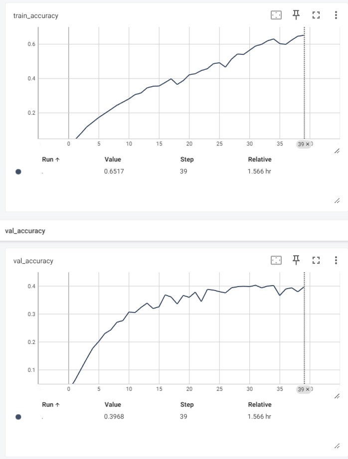

<h4>School of Quants. ML2 project. Tiny Image classification</h4>

In this project we trained EfficientNet model for image classification (Tiny Image Dataset)

Index	Model	Accuracy
0	EfficientNetb4_64x64_locally_trained	0.405
1	EfficientNetb4_224x224_ImageNet_pretrained_tuned	0.755

<ul>
    <li>As the first part, we trained untrained EfficientNet model from scratch and get the accuracy on validation of 0.404. Grade - 9.02 / 10</li>
    <li>As a second part of the task, we trained a pretrained EfficientNet model on Imagenet 1k dataset, we added the last layer to make the last dense layer output 200 values which matches the number of labels in the dataset. With this, we were able to achieve 0.755 accuracy on validation set, which is shy of the target 0.84, but still good enough. Grade 7.53 / 10</li>
</ul>

Unpack zipped data file into data folder with train and val folders. Also in the log folder we have log files which tracked the progress of the training and validation. We used Tensorboard for tracking.

 

